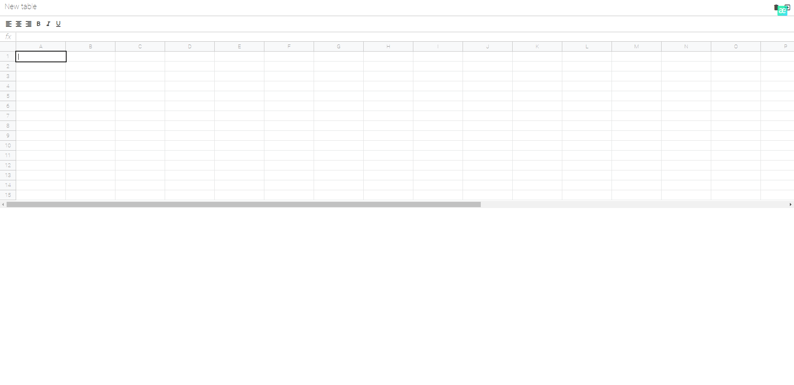

# Excel web application developed in pure JS. Without using frameworks and libraries.

This micro application is based on the base of a regular excel, similar to Google Sheets. 
This application is written in pure javascript. With the ability:
- [x] create new tables
- [x] save tables
- [x] make a table resize
- [x] apply field calculation
- [x] as well as minimal field styling.

---


---
## Tech stack
* JavaScript ES6
* ESLint
* Git
* Webpack

---
### For start, Install deps 

```
$ npm install
```

### To launch app
```
$ npm run start
```
Runs the app in the development mode.
Open http://localhost:3000 to view it in the browser.
